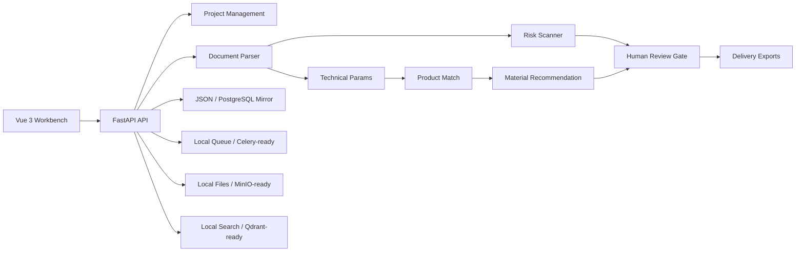

# Bid Risk Control Agent

**Language:** English | [简体中文](README.zh-CN.md)

[](https://github.com/liao96312/biaoshu/actions/workflows/ci.yml)


Bid Risk Control Agent is an intelligent bid-document review system. It helps teams parse tender files, identify disqualification risks, check technical deviations, recommend supporting materials, run human review, keep audit traces, and export delivery packages.


## What It Covers

- Project creation and recent-project archive gate.
- Tender document upload and parsing for PDF, Word, Excel, images, and text files.
- Risk scanning for disqualification clauses, key terms, source pages, keywords, AI reasons, and handling suggestions.
- Technical parameter extraction and deviation matching against company product materials.
- Company material search and recommendation, with auto-bind support.
- Human review loop for confirming, ignoring, approving, or requesting fixes.
- Audit logs and review feedback persistence.
- Export package generation: deviation table, material gap table, scoring matrix, bid outline, risk report, PDF report.
- Rule operations through risk-rule APIs.
- Deployment path from local JSON storage to PostgreSQL mirror, Redis/Celery, Qdrant, and MinIO.

## Architecture



## Quick Start

Backend:

```powershell
python -m venv .venv
.\.venv\Scripts\Activate.ps1
pip install -r requirements.txt
uvicorn app.main:app --reload --host 127.0.0.1 --port 8000
```

Frontend:

```powershell
cd web
npm install
npm run dev
```

Open:

- Workbench: `http://127.0.0.1:5173/`
- API docs: `http://127.0.0.1:8000/docs`
- Health: `http://127.0.0.1:8000/healthz`
- Readiness: `http://127.0.0.1:8000/readyz`
- Legacy backend static page: `http://127.0.0.1:8000/app/`

## Docker Compose

```powershell
copy .env.example .env
docker compose up --build
```

Compose starts `web`, `api`, `worker`, PostgreSQL, Redis, Qdrant, and MinIO. The default frontend URL is:

```text
http://127.0.0.1:5173/
```

Common checks:

```powershell
docker compose config
docker compose ps
docker compose logs -f api
```

## Security And Operations

- Auth: local mode is open by default; set `BID_AGENT_TOKEN` for Bearer auth and `BID_AGENT_API_KEYS` for `X-API-Key`.
- Tenant isolation: `X-Company-ID` limits projects, materials, files, and exports to one company.
- Upload limit: `BID_AGENT_MAX_UPLOAD_BYTES` defaults to 50 MB.
- File boundaries: downloads and deletes are checked under `storage/` to avoid path traversal.
- Health checks: `/healthz` exposes service state without leaking absolute local paths.
- Readiness: `/readyz` verifies writable storage and PostgreSQL connectivity when enabled.
- Frontend proxy: production Nginx proxies `/api/`, `/ws/`, and `/healthz` to the backend.

## API Overview

```text
POST /api/v1/projects
GET  /api/v1/projects
GET  /api/v1/projects/{project_id}
POST /api/v1/projects/{project_id}/documents
GET  /api/v1/projects/{project_id}/risks
PATCH /api/v1/projects/{project_id}/risks/{risk_id}
GET  /api/v1/projects/{project_id}/clauses
GET  /api/v1/projects/{project_id}/deviations
PATCH /api/v1/projects/{project_id}/deviations/{param_id}
POST /api/v1/projects/{project_id}/deviations/rematch
GET  /api/v1/projects/{project_id}/material-gaps
GET  /api/v1/projects/{project_id}/material-recommendations
POST /api/v1/projects/{project_id}/material-recommendations/auto-bind
GET  /api/v1/projects/{project_id}/scoring-matrix
GET  /api/v1/projects/{project_id}/bid-outline
POST /api/v1/projects/{project_id}/exports
GET  /api/v1/exports/{export_id}/download
POST /api/v1/companies/{company_id}/materials
GET  /api/v1/companies/{company_id}/materials
GET  /api/v1/rules/risk
PUT  /api/v1/rules/risk
GET  /api/v1/system/capabilities
GET  /api/v1/system/metrics
GET  /api/v1/system/integrations
GET  /api/v1/system/activity
WS   /ws/tasks/{task_id}
```

## Verification

```powershell
python -m unittest discover -s tests
python scripts/smoke_test.py
cd web
npm run build
```

GitHub Actions runs backend unit tests, API smoke checks, frontend dependency audit, and frontend build on `main` pushes and pull requests.

## Repository Layout

```text
app/       FastAPI API, services, agents, repositories, adapters, static assets
db/        PostgreSQL schema
scripts/   Smoke test, PostgreSQL init, state migration, connection checks
tests/     API, parser, export, task, rule, and workflow regression tests
web/       Vue 3 + Vite workbench
```

## Resume Summary

Built a bid-risk-control Agent system with FastAPI and Vue 3, covering tender parsing, disqualification-risk detection, technical-deviation checking, company material recommendation, human review workflow, and export delivery. The system includes local runnable storage, containerized deployment, CI smoke tests, and reserved boundaries for PostgreSQL, Redis/Celery, Qdrant, MinIO, and LLM adapters.
