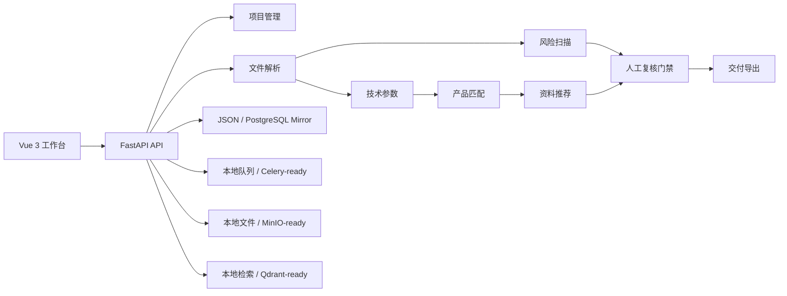

# 标书风控 Agent

**语言：** [English](README.md) | 简体中文

[](https://github.com/liao96312/biaoshu/actions/workflows/ci.yml)


标书风控 Agent 是一个投标文件智能复核系统。它帮助团队解析招标文件、识别废标风险、核对技术偏离、推荐企业资料、完成人工复核、保留审计痕迹，并导出交付包。


## 覆盖能力

- 项目创建和最近项目归档门禁。
- PDF、Word、Excel、图片和文本招标文件上传解析。
- 废标风险、关键条款、来源页码、命中关键词、AI 理由和处理建议识别。
- 技术参数抽取，并与企业产品资料做偏离匹配。
- 企业资料检索推荐，支持自动绑定到风险项。
- 人工复核闭环：确认、忽略、通过、待修改和反馈沉淀。
- 审计日志与复核反馈保存。
- 交付导出：偏离表、材料缺口表、评分矩阵、投标大纲、风控报告、PDF 报告。
- 通过风险规则 API 做规则运营。
- 从本地 JSON 存储扩展到 PostgreSQL mirror、Redis/Celery、Qdrant 和 MinIO。

## 系统架构



## 快速启动

后端：

```powershell
python -m venv .venv
.\.venv\Scripts\Activate.ps1
pip install -r requirements.txt
uvicorn app.main:app --reload --host 127.0.0.1 --port 8000
```

前端：

```powershell
cd web
npm install
npm run dev
```

访问地址：

- 工作台：`http://127.0.0.1:5173/`
- API 文档：`http://127.0.0.1:8000/docs`
- 健康检查：`http://127.0.0.1:8000/healthz`
- 就绪检查：`http://127.0.0.1:8000/readyz`
- 旧版后端静态页：`http://127.0.0.1:8000/app/`

## Docker Compose

```powershell
copy .env.example .env
docker compose up --build
```

Compose 会启动 `web`、`api`、`worker`、PostgreSQL、Redis、Qdrant 和 MinIO。默认前端地址：

```text
http://127.0.0.1:5173/
```

常用检查：

```powershell
docker compose config
docker compose ps
docker compose logs -f api
```

## 安全与运维

- 认证：本地默认开放；设置 `BID_AGENT_TOKEN` 后使用 Bearer auth，设置 `BID_AGENT_API_KEYS` 后支持 `X-API-Key`。
- 租户隔离：请求带 `X-Company-ID` 后，项目、资料、文件和导出限制在对应企业范围。
- 上传限制：`BID_AGENT_MAX_UPLOAD_BYTES` 默认 50 MB。
- 文件边界：下载和删除会校验文件仍在 `storage/` 下，避免路径穿越。
- 健康检查：`/healthz` 返回服务状态，不暴露本机绝对路径。
- 就绪检查：`/readyz` 校验本地存储可写，并在启用 PostgreSQL 时检查数据库链路。
- 前端代理：生产 Nginx 代理 `/api/`、`/ws/` 和 `/healthz` 到后端。

## API 概览

```text
POST /api/v1/projects
GET  /api/v1/projects
GET  /api/v1/projects/{project_id}
POST /api/v1/projects/{project_id}/documents
GET  /api/v1/projects/{project_id}/risks
PATCH /api/v1/projects/{project_id}/risks/{risk_id}
GET  /api/v1/projects/{project_id}/clauses
GET  /api/v1/projects/{project_id}/deviations
PATCH /api/v1/projects/{project_id}/deviations/{param_id}
POST /api/v1/projects/{project_id}/deviations/rematch
GET  /api/v1/projects/{project_id}/material-gaps
GET  /api/v1/projects/{project_id}/material-recommendations
POST /api/v1/projects/{project_id}/material-recommendations/auto-bind
GET  /api/v1/projects/{project_id}/scoring-matrix
GET  /api/v1/projects/{project_id}/bid-outline
POST /api/v1/projects/{project_id}/exports
GET  /api/v1/exports/{export_id}/download
POST /api/v1/companies/{company_id}/materials
GET  /api/v1/companies/{company_id}/materials
GET  /api/v1/rules/risk
PUT  /api/v1/rules/risk
GET  /api/v1/system/capabilities
GET  /api/v1/system/metrics
GET  /api/v1/system/integrations
GET  /api/v1/system/activity
WS   /ws/tasks/{task_id}
```

## 验证

```powershell
python -m unittest discover -s tests
python scripts/smoke_test.py
cd web
npm run build
```

GitHub Actions 会在 `main` 分支 push 和 pull request 时运行后端单测、API 冒烟、前端依赖审计和前端构建。

## 目录结构

```text
app/       FastAPI API、服务、Agent、仓储、适配器、静态资源
db/        PostgreSQL 表结构
scripts/   冒烟测试、数据库初始化、状态迁移、连接检查
tests/     API、解析、导出、任务、规则和工作流回归测试
web/       Vue 3 + Vite 工作台
```

## 简历描述

可描述为：独立完成一个面向投标场景的标书风控 Agent 系统，基于 FastAPI + Vue 3 实现招标文件解析、废标风险识别、技术偏离核对、企业资料推荐、人工复核闭环和导出交付。系统预留 PostgreSQL、Redis/Celery、Qdrant、MinIO 和 LLM 适配边界，具备本地可运行、容器化部署和完整冒烟测试能力。
